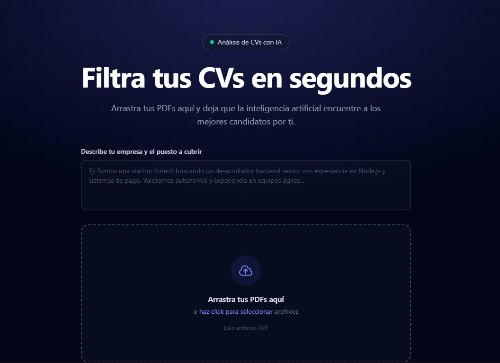

# Filter CVs with IA



Aplicación web para analizar y puntuar CVs en PDF con inteligencia artificial. Describes tu empresa y el puesto a cubrir, arrastras los PDFs de los candidatos, y una IA (vía [OpenRouter](https://openrouter.ai)) evalúa cada CV devolviendo una puntuación de encaje, un resumen, fortalezas, debilidades y una recomendación. Los resultados se muestran en un dashboard ordenado por puntuación.

Construido con [Astro](https://astro.build) + Tailwind CSS, desplegado como backend serverless en Vercel.

## Cómo funciona

1. **Inicio (`/`)** — Hero con un textarea para describir la empresa/puesto y una zona de drag & drop para subir PDFs.
2. **Análisis (`/api/analyze`)** — Endpoint serverless que recibe la descripción de la empresa y los PDFs, envía cada uno a OpenRouter (modelo `google/gemini-2.5-flash`, con soporte nativo de PDF) y devuelve un JSON con la evaluación de cada candidato.
3. **Dashboard (`/dashboard`)** — Muestra los resultados guardados en `sessionStorage`: estadísticas generales, el perfil de empresa usado, y una tarjeta por candidato con su puntuación, fortalezas, debilidades y recomendación.
4. **404 (`/404`)** — Página de error personalizada para rutas inexistentes.

## Estructura del proyecto

```text
/
├── src
│   ├── components
│   │   └── Hero.astro          # Formulario de empresa + dropzone de PDFs
│   ├── layouts
│   │   └── Layout.astro
│   ├── pages
│   │   ├── index.astro         # Página de inicio
│   │   ├── dashboard.astro     # Panel de resultados
│   │   ├── 404.astro           # Página de error
│   │   └── api
│   │       └── analyze.ts      # Endpoint serverless que llama a OpenRouter
│   └── styles
│       └── global.css
└── astro.config.mjs            # output: 'server' + adapter de Vercel
```

## Configuración

Copia `.env.example` a `.env` y añade tu API key de OpenRouter:

```sh
OPENROUTER_API_KEY=sk-or-...
```

Consíguela en [openrouter.ai/keys](https://openrouter.ai/keys). En producción (Vercel), configúrala como variable de entorno del proyecto.

## Comandos

Todos los comandos se ejecutan desde la raíz del proyecto:

| Comando          | Acción                                              |
| :--------------- | :-------------------------------------------------- |
| `pnpm install`   | Instala las dependencias                            |
| `pnpm dev`       | Inicia el servidor local en `localhost:4321`        |
| `pnpm build`     | Construye el sitio para producción en `./dist/`     |
| `pnpm preview`   | Previsualiza el build localmente antes de desplegar |
| `pnpm astro ...` | Ejecuta comandos de la CLI de Astro                 |

## Despliegue

El proyecto usa `output: 'server'` con el adaptador `@astrojs/vercel`, por lo que se despliega directamente en [Vercel](https://vercel.com) como funciones serverless. Solo hace falta configurar la variable de entorno `OPENROUTER_API_KEY` en el proyecto de Vercel.
